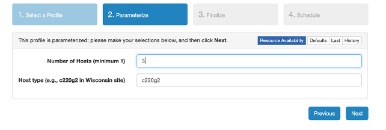
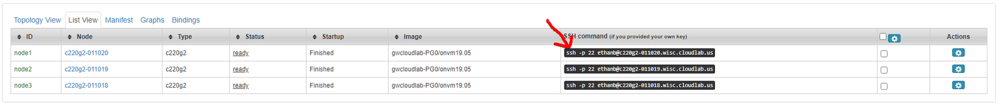

Three Node Topology Tutorial
=====================================

Getting Started
-----------------

- This tutorial assumes that you have access to `CloudLab <https://cloudlab.us/>`_ and a basic working knowledge of CloudLab and `SSH <https://www.ssh.com/ssh/>`_
- Also ensure that you have followed the development environment configuration instructions in our `Dev Environment <../devenv>`_ Wiki page

    - Specifically, make sure that you follow the steps in “Getting Started”, “Setup OpenSSH”, and everything up to instantiating an experiment in the “CloudLab Work Environment” section

Video Tutorial
-----------------

If you want to follow along with this tutorial, we have created a video for your convenience.

.. raw:: html

    <iframe width="560" height="315" src="https://www.youtube.com/embed/eU7hWxTVSrs" frameborder="0" allow="accelerometer; encrypted-media; gyroscope" allowfullscreen></iframe>

Instantiating the ONVM CloudLab Profile
---------------------------------------------------------------------------------------------------------------------------------

- Click `here <https://www.cloudlab.us/p/GWCloudLab/onvm>`_ for the ONVM CloudLab Profile
- Click “Instantiate”

.. image:: ../images/cloudlab-1.png
   :width: 600

- Enter the number of hosts you want — for a three-node topology, enter “3”
- Ensure that the host type is “c220g1” or “c220g2”

- Click “Next”
    - The generated topology image should somewhat resemble the image below

.. image:: ../images/cloudlab-3.jpeg
   :width: 600

- Optionally, enter a name for the experiment in the “Name” field
- Click “Next”
- Click “Finish”
- Wait for the experiment to boot up

Connecting to CloudLab in Visual Studio Code via SSH
------------------------------------------------------

- Click “List View” to see the SSH commands to connect to your nodes

- Ensure that your generated SSH command works by running it in terminal

**For development within the Visual Studio Code environment:**

- See more detailed setup instructions in our `Dev Environment Wiki <../devenv>`__ if you wish to use the VS Code environment for your setup

The following steps should be performed **for each node:**

- Copy relevant information into your :code:`~/.ssh/config` file:

    .. code-block::
        :linenos:

        Host NodeXAddress
        HostName NodeXAddress
        Port 22
        User CloudLabUsername
        IdentityFile ~/.ssh/PrivateKeyFile
        AddKeysToAgent yes

    - Note that you can add other options as necessary

- Open Visual Studio Code
- Click the green Remote-SSH extension button (SSH logo) in the bottom-left corner
- Select :code:`Remote-SSH: Connect to Host` from the options that appear in the command palette
- Select the address of the node you want to connect to
- Visual Studio Code will automatically connect and set itself up

    - See `Troubleshooting Tips <https://code.visualstudio.com/docs/remote/troubleshooting#_troubleshooting-hanging-or-failing-connections>`_ for connection issues and `Fixing SSH File Permissions <https://code.visualstudio.com/docs/remote/troubleshooting#_fixing-ssh-file-permission-errors>`_ for permissions errors

- Once connected, navigate to the openNetVM repository folder: :code:`cd /local/onvm/openNetVM`
- Now, finish configuring your workspace by selecting **File → Open** or **File → Workspace** and selecting the openNetVM folder (:code:`/local/onvm/openNetVM`)

Setting Up a Three-Node Topology
----------------------------------

The goal of this document is to configure the three nodes so that the first can act as a client, the third as a server, and the second node will act as a middlebox running OpenNetVM. The first and third nodes will use the kernel network stack, while the second will use DPDK.

Ensuring That Nodes Are Connected
^^^^^^^^^^^^^^^^^^^^^^^^^^^^^^^^^^^^^

- Connect to your CloudLab nodes in either Visual Studio Code or any SSH client
- With a three-node topology, your first node (node1) should be connected to one port in your second node (node2) and your third node (node3) should be connected to the other port in your second node (node2). Notice that this forms a “chain-like” structure like the one visualized in the topology image generated by CloudLab
- To determine which NICs are connected on each node, SSH into the node and run :code:`ifconfig`

    .. image:: ../images/ifconfig-1.png
        :width: 600

    - The connected NIC is the one with the local IP subnet. For the first node, it should be :code:`192.168.1.1`

        - Note that the local subnet is :code:`192.168.1.x`. This means that each of the NICs should have their :code:`inet addr` field in the :code:`ifconfig` command output start with :code:`192.168.1.`. 
        - For each NIC in the connection chain, the IP address should be :code:`192.168.1.<previous + 1>`. This means that the first should be :code:`192.168.1.1`, the second should be :code:`192.168.1.2`, and so on. Note that since node2 (and any other intermediate nodes in the case of a chain with more than three nodes) has two NICs configured for this, it will have two NICs with local addresses. This is seen in the below screenshot.

        .. image:: ../images/ifconfig-2.png
            :width: 600

        - The NIC names and ports (e.g. eth0 or eth1) can be completely random, but always have the local IP address mask (start with :code:`192.168.1`)

Bind Intermediate Nodes to DPDK
^^^^^^^^^^^^^^^^^^^^^^^^^^^^^^^^^^

Before running the ONVM manager, we need to ensure that the connected NICs on node2 are bound to DPDK. DPDK has a script to determine whether NICs are bound or not. 

- Identify which NICs are connected to the other nodes using :code:`ifconfig` on node2 and checking the :code:`inet addr` against the expected output above
- Navigate to the openNetVM folder that comes pre-installed on each node using :code:`cd /local/onvm/openNetVM`
- Pull the most recent version of openNetVM from GitHub: :code:`git pull origin master`
- Unbind the connected NICs: :code:`sudo ifconfig ethxxx down`
- Run the ONVM :code:`setup_environment.sh` script

    - :code:`cd scripts`
    - :code:`source ./setup_cloudlab.sh`
    - :code:`./setup_environment.sh`

    .. image:: ../images/setup_environment.png
        :width: 600

- Ensure that you see the **two** NICs in the “Network devices using DPDK-compatible driver”

    - If you only see one NIC, it’s possible that you did not unbind the other NIC from the kernel driver using :code:`sudo ifconfig ethxxx down`. Instructions for that are above.

Verifying Node Chain Connections with openNetVM
-------------------------------------------------

Run the openNetVM Manager and Bridge NF
^^^^^^^^^^^^^^^^^^^^^^^^^^^^^^^^^^^^^^^^^

In the case of the three-node topology, we only need to run openNetVM on node2. These instructions should only be performed on all intermediate nodes in a longer chain.

- Navigate to the openNetVM folder: :code:`cd /local/onvm/openNetVM`
- Compile the Manager: :code:`cd onvm && make && cd ..`
- Compile the NFs: :code:`cd examples && make && cd ..`
- Run the Manager: :code:`./onvm/go.sh 0,1,2 3 0xF8 -s stdout`

    - The manager should show both ports running

    .. image:: ../images/onvm-1.png
        :width: 600

- In another terminal pane, run the Bridge NF

    - :code:`cd examples/bridge`
    - :code:`./go.sh 1 1`

    .. image:: ../images/bridge.png
        :width: 600

Ping Between Nodes in Chain
^^^^^^^^^^^^^^^^^^^^^^^^^^^^^^^^

When the ONVM Manager and Bridge NF are running, we can ping from node1 to node3, using node3’s local IP address, despite node1 and node3 not being directly connected. We can also ping node1 from node3 using node1’s local IP address. The following steps can be performed on either node1 or node3. Just ensure that you are using the opposite node’s direct IP address. The direct IP of node1 should be :code:`192.168.1.1` and the direct IP of node3 should be :code:`192.168.1.4`. Since these are not bound to DPDK, we can still verify this by running :code:`ipconfig` on either node.

- Ping the opposite node: :code:`ping 192.168.1.x` where :code:`x` is the node’s NIC number in the chain. You will see the number of packets sent updated in the manager

    .. image:: ../images/ping-1.gif
        :width: 600

    - Note that there is no output in node3. You can verify that openNetVM is enabling the connections by closing the Manager and/or Bridge NF and repeating the ping command

    .. image:: ../images/ping-2.gif
        :width: 600